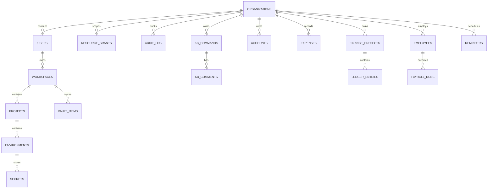

# Command Center — System Architecture

This document provides a comprehensive technical overview of the **Command Center** architecture, security model, data flow, software stack, and codebase organization. It is designed to serve as an authoritative guide for software engineers and AI/LLM context agents interacting with or contributing to this repository.

---

## 1. Project Overview & Philosophy

**Command Center** is a private, multi-tenant operations platform tailored for developers, creators, and small businesses. It combines sensitive security operations with operational management under two strictly demarcated security zones:

- **Zone A (Zero-Knowledge Security Zone)**: Password vaulting and environment secrets management. Data is encrypted client-side using Web Crypto API / Argon2id before it touches the network. The server stores only ciphertext and wrapped key payloads; it never possesses the master password or unencrypted secrets.
- **Zone B (Tenant-Isolated Operations Zone)**: Developer knowledge base, financial ledgers, payroll, tax records, CA invoice exports, and automated reminders. Data is server-readable to enable reporting, AI parsing, aggregations, and background background tasks, but strictly isolated per organization using PostgreSQL Row-Level Security (RLS).

### Core Architectural Principles
1. **Zero-Knowledge by Default for Secrets**: The server cannot read secrets or vault items under any circumstances.
2. **Database-Enforced Security Guarantees**: Multi-tenancy and audit log immutability are enforced by PostgreSQL RLS policies at the database layer—not merely in application code.
3. **Monetary Integrity**: All financial calculations use integer cents (`bigint`). Floating-point math for money is strictly prohibited. Database `CHECK` constraints enforce financial invariants.
4. **Lightweight & Fast Runtime**: Powered by **Bun** for both runtime execution and HTTP service delivery, paired with **Next.js 16** for modern UI rendering.

---

## 2. High-Level Architecture Diagram

```mermaid
graph TD
    subgraph Client ["Browser / Next.js Client (apps/web)"]
        UI["React UI (Next.js 16 App Router)"]
        ZK["Client Crypto Engine (zk-crypto.ts)\nWeb Crypto API + Argon2id"]
    end

    subgraph Server ["API Layer (apps/api)"]
        BunHTTP["Bun Native HTTP Server (Bun.serve)"]
        AuthModule["Auth & Session Engine\n(Argon2, TOTP MFA, Redis Sessions)"]
        Router["Module Routes\n(Secrets, Vault, KB, Finance, Reminders)"]
        Sweeper["Background Reminder Sweeper\n(Hourly Idempotent Cron)"]
    end

    subgraph Data ["Data & Storage Layer"]
        PGAdmin[("PostgreSQL\nDATABASE_URL (Admin Role)\n[Migrations Only]")]
        PGApp[("PostgreSQL\nAPP_DATABASE_URL (Restricted Role)\n[RLS Enforced]")]
        Redis[("Redis DB 0\n[Sessions, Rate Limiting, MFA State]")]
        GCS[("Google Cloud Storage\n[KB Binary Attachments]")]
    end

    subgraph Integrations ["External / Sidecar Services"]
        Chrome["Headless Chromium\n[CA Invoice PDF Generation]"]
        Ollama["Ollama Local LLM\n[CA Emails & Secret Import Parsing]"]
        Slack["Slack API / Webhook\n[Reminder Alerts]"]
        SMTP["SMTP Server\n[Password Reset & Invoice Emails]"]
    end

    UI -->|HTTPS / REST API| BunHTTP
    UI <-->|Derives & Encrypts Client-Side| ZK
    BunHTTP --> Router
    Router --> AuthModule
    AuthModule <-->|Sessions & Limits| Redis
    Router -->|Transaction-Scoped RLS (withTenantTx)| PGApp
    PGAdmin -.->|DDL & Schema| PGApp
    Router -->|Pre-signed URLs| GCS
    Router -->|PDF Rendering| Chrome
    Router -->|LLM Prompts| Ollama
    Router -->|Email Dispatch| SMTP
    Sweeper -->|Check Due Items & Post| Slack
```

---

## 3. Technology Stack & Dependencies

| Component | Technology | Description / Usage |
|---|---|---|
| **Runtime Engine** | [Bun](https://bun.sh/) ≥ 1.3.14 | Native TypeScript execution, package management, native `Bun.serve` HTTP server, and native `Bun.password` Argon2 hashing. |
| **Frontend Framework** | [Next.js](https://nextjs.org/) 16 (App Router) | React Server & Client Components, Turbopack, standalone deployment build output. |
| **Styling & UI** | Tailwind CSS + Lucide Icons | Utility-first styling with accessible icon sets and responsive UI components. |
| **Client-Side Cryptography** | Web Crypto API + `@noble/hashes` | Native `crypto.subtle` for AES-256-GCM and PBKDF2; `@noble/hashes` for pure-JS Argon2id key derivation. |
| **Database** | PostgreSQL 13+ | Primary relational datastore using `pgcrypto` and `citext` extensions. |
| **DB Driver** | Bun SQL (`bun:sql`) | Fast, native Postgres driver supporting parameterization and connection pooling. |
| **Session & Cache** | Redis | Session state (`session:<token>`), user session indexes (`user-sessions:<userId>`), sliding-window rate limiting. |
| **File Attachments** | Google Cloud Storage (GCS) | Blob storage for knowledge base files accessed via server-signed pre-signed URLs. |
| **Document Rendering** | Headless Chromium (`puppeteer-core`) | Local headless Chrome process used for exporting CA invoice PDFs. |
| **AI / LLM Operations** | Local Ollama (`OLLAMA_HOST`) | Local LLM inference for drafting monthly CA emails and parsing pasted env/secret strings. |
| **Notifications** | Slack Webhooks & SMTP | Outbound alerts for due reminders and transactional emails (password reset, invoices). |

---

## 4. Security Architecture

### 4.1 Zone A: Zero-Knowledge Client-Side Cryptography (`apps/web/lib/zk-crypto.ts`)

The Secrets and Vault modules operate on a zero-knowledge architectural model. The server stores ciphertext and wrapped key structures, but never possesses the master key, recovery key, or unencrypted data.

#### Key Hierarchy & Derivation Pipeline

```
Master Password + Salt ───> KDF (Argon2id / PBKDF2) ───> Password Key (AES-GCM 256)
                                                                │
Recovery Key (Random 32B Base64) ───────────────────────────────┤ (Both wrap the SAME key)
                                                                ▼
                                                       Workspace Key (AES-GCM 256)
                                                                │ (Wraps per-project/item key)
                                                                ▼
                                                     Data Encryption Key (DEK)
                                                                │ (Encrypts actual payload)
                                                                ▼
                                                        Ciphertext + IV
```

1. **Workspace Key**: Each Workspace generates a 256-bit random AES-GCM `Workspace Key`. This key is never derived from user input; it is truly random.
2. **Dual Wrapping**:
   - **Password Wrapper**: `Workspace Key` wrapped under `Password Key` (derived via Argon2id from Master Password + `kdf_salt`).
   - **Recovery Wrapper**: `Workspace Key` wrapped under `Recovery Key` (a 32-byte high-entropy random key displayed to the user once at workspace creation).
3. **Data Encryption Keys (DEKs)**: Each Secrets Project and Vault Item generates its own 256-bit `DEK`. The `DEK` is wrapped using the `Workspace Key`.
4. **Ciphertext Encryption**: Actual secrets or vault records are encrypted using their respective `DEK` via AES-256-GCM. AES-GCM authentication tags are appended directly to the ciphertext buffer by Web Crypto API.
5. **Non-Destructive Operations**: Changing a master password or using a recovery key only requires re-wrapping the single, small `Workspace Key`. Underling DEKs and encrypted secrets remain untouched.
6. **Implicit Password Validation**: There is no password hash canary. Attempting to unwrap the `Workspace Key` with an invalid password-derived key causes an AES-GCM authentication tag mismatch error, serving as the cryptographic authentication check.

---

### 4.2 Zone B: Multi-Tenant Database Isolation & Dual-Role Security

PostgreSQL Row-Level Security (RLS) guarantees tenant isolation at the database layer.

#### Two DB Roles Architectural Pattern

```
DATABASE_URL       ──> Admin Role (e.g. cc_admin)       ──> Full DDL & Schema Migrations (Bypasses RLS)
APP_DATABASE_URL    ──> Restricted Role (command_center_app) ──> All API Requests (Enforces RLS)
```

1. **Admin Role (`DATABASE_URL`)**: Superuser / DDL role used strictly during deployment or via `bun run migrate` for schema alterations.
2. **Application Role (`APP_DATABASE_URL`)**: Restricted non-superuser role (`command_center_app`) used by all running API routes. Superusers bypass RLS even with `FORCE ROW LEVEL SECURITY`, making a non-superuser application role mandatory.
3. **Transaction-Scoped Tenant Scoping (`apps/api/core/db.ts`)**:
   All authenticated route operations are executed within a tenant transaction context wrapper `withTenantTx`:
   ```typescript
   export async function withTenantTx<T>(ctx: AuthCtx, fn: (tx: Bun.SQL) => Promise<T>): Promise<T> {
     return sql.begin(async (tx) => {
       await tx`SELECT set_config('app.current_org_id', ${ctx.orgId}, true)`;
       await tx`SELECT set_config('app.current_user_id', ${ctx.userId}, true)`;
       return fn(tx);
     });
   }
   ```
   `set_config(..., true)` sets the session variable local to the active transaction. If a query forgets an `org_id` WHERE clause, PostgreSQL RLS blocks cross-tenant data access automatically.
4. **Immutable Audit Logging**:
   `audit_log` is an append-only audit table. The application role possesses `SELECT` and `INSERT` policies, but deliberately lacks `UPDATE` or `DELETE` policies. Even if the application process is fully compromised, existing audit logs cannot be modified or purged.

---

### 4.3 Authentication, Session & Access Control

- **Password Hashing**: Primary user account passwords are hashed using Argon2id via Bun's native `Bun.password.hash`.
- **Session Management**: Session tokens are 32-byte cryptographically secure random hex strings stored in Redis (`session:<token>`) with a 7-day TTL. Active session tokens are indexed under a set `user-sessions:<userId>`.
- **Session Revocation**: Supports revoking all other sessions ("log out everywhere else") and immediate invalidation of all sessions upon password reset.
- **Two-Factor Authentication (MFA)**:
  - Supports TOTP (HMAC-SHA1 RFC 6238).
  - Provisioning stores an un-enabled secret until confirmed by a valid token.
  - Generates 8 single-use backup codes, stored as Argon2id hashes in `mfa_backup_codes`.
- **Rate Limiting (`apps/api/core/rate-limit.ts`)**:
  - Redis-backed sliding window rate limiter protects endpoints against brute-force attacks (`/api/auth/login`, `/api/auth/signup`, `/api/auth/login/mfa`, `/api/auth/forgot-password`).

---

## 5. Core Feature Modules

### 5.1 Secrets Management (`apps/api/modules/secrets`)
- Organizes developer secrets by **Workspace** $\rightarrow$ **Project** $\rightarrow$ **Environment** (`dev`, `staging`, `prod`) $\rightarrow$ **Secrets**.
- Fully zero-knowledge client-side encrypted key-value pairs.
- Includes Ollama-assisted AI parsing: client sends raw text to local Ollama instance to extract key-value structures before encrypting client-side.

### 5.2 Password Vault (`apps/api/modules/vault`)
- Store credentials, login URLs, and private notes.
- **Metadata Indexing**: Item `label` and `url` remain plaintext for instant client-side filtering and UI searching.
- **Payload Encryption**: Username, password, and notes are combined into a JSON payload and encrypted client-side with a unique per-item DEK.

### 5.3 Developer Knowledge Base (`apps/api/modules/knowledge`)
- Shared team command snippets, runbooks, context notes, and discussion comments.
- **File Attachments**: Direct GCS integration. The API server generates GCS pre-signed URLs for uploads/downloads; binary data flows directly between the user browser and GCS, bypassing the API server memory.

### 5.4 Finance, Payroll & Tax Operations (`apps/api/modules/finance`)
- **Accounts & Ledgers**: Tracks bank, credit card, loan, cash, and investment accounts.
- **Money Handling**: Stored exclusively as integer cents (`amount_cents bigint`).
- **Finance Projects**: Separate ledger scoping for project-based earnings/expenses (can optionally link to a secrets project).
- **Payroll Engine**: Computes gross pay, tax withholdings, and net pay. Database table constraint enforces invariant: `CHECK (net_cents = gross_cents - tax_withheld_cents)`.
- **CA Invoices & CA Emails**:
  - Renders custom CA invoice HTML templates and uses headless Chromium (`puppeteer-core`) to generate PDF attachments.
  - Integrated with local Ollama LLM to draft professional monthly communication emails sent via SMTP.

### 5.5 Reminders & Slack Alerts (`apps/api/modules/reminders`)
- Standalone due-date tracking for recurring/one-off bills, loans, tax payments, and vehicle tasks.
- **Background Sweeper**: An hourly background task (`startReminderSweepInterval`) scans for pending reminders due on or before the current date.
- **Delivery**: Sends automated notifications directly to configured Slack channels via Slack Webhooks / Bot API token. Idempotency is preserved at calendar-day granularity.

### 5.6 Audit Trail (`apps/api/modules/audit`)
- Tracks administrative and operational actions (`action`, `resource_type`, `resource_id`, `actor_id`, `ip`, `metadata`).
- Append-only database table shielded by PostgreSQL RLS.

---

## 6. Codebase Structure

```
command-center/
├── .github/
│   └── workflows/
│       ├── ci.yml                 # Typechecking & unit test suite
│       └── deploy.yml             # Container build & GKE deployment pipeline
├── apps/
│   ├── api/                       # Bun Backend Application
│   │   ├── core/                  # Infrastructure primitives
│   │   │   ├── audit.ts           # Audit log writer
│   │   │   ├── auth.ts            # Authentication & session handling
│   │   │   ├── config.ts          # Environment configuration & validation
│   │   │   ├── db.ts              # Bun SQL client & RLS transaction helper
│   │   │   ├── mfa.ts             # TOTP & backup code generators
│   │   │   ├── rate-limit.ts      # Redis sliding window rate limiter
│   │   │   ├── router.ts          # Safe wrapper for HTTP handlers
│   │   │   └── storage.ts         # Google Cloud Storage pre-signed URL utility
│   │   ├── migrations/            # SQL migration files (0001_core.sql to 0015_...)
│   │   ├── modules/               # Feature domains
│   │   │   ├── audit/             # Audit log API
│   │   │   ├── finance/           # Accounts, expenses, payroll, CA invoices
│   │   │   ├── knowledge/         # KB commands, comments, GCS attachments
│   │   │   ├── reminders/         # Reminders & background sweeper
│   │   │   ├── secrets/           # Workspaces, projects, ZK secret management
│   │   │   └── vault/             # Zero-knowledge credential vault
│   │   ├── scripts/               # DB bootstrap & backup/restore utilities
│   │   ├── index.ts               # Bun HTTP server & main route table
│   │   └── Dockerfile             # Production container definition for API
│   │
│   └── web/                       # Next.js 16 Frontend Application
│       ├── app/                   # Next.js App Router pages & layouts
│       ├── components/            # UI components (Tailwind CSS, modal primitives)
│       ├── lib/                   # API clients & cryptographic engine
│       │   ├── zk-crypto.ts       # Zero-knowledge Web Crypto & Argon2id implementation
│       │   ├── workspace-context.tsx # React context managing unwrapped keys in memory
│       │   ├── api.ts             # Base HTTP fetch wrapper
│       │   └── *-api.ts           # Domain-specific frontend API bindings
│       └── Dockerfile             # Production container definition for Web
│
├── infrastructure/
│   └── k8s/                       # Kubernetes manifests (Kustomize base & overlays)
├── scripts/
│   └── dev.sh                     # Concurrent local development runner
├── package.json                   # Monorepo root scripts & dependencies
└── README.md                      # Quickstart guide
```

---

## 7. Database Entity Relationship Summary



---

## 8. Deployment & CI/CD Pipelines

- **Local Development**: Executed via `./scripts/dev.sh` which runs `bun --hot apps/api/index.ts` and `next dev` concurrently.
- **Dockerization**:
  - `apps/api/Dockerfile`: Multi-stage build for Bun runtime API server.
  - `apps/web/Dockerfile`: Standalone Next.js 16 container build.
- **Kubernetes (GKE)**: Located in `infrastructure/k8s/`. Uses Kustomize with a `base` definition and `dev`, `staging`, `production` environment overlays.
- **CI/CD Workflow (`.github/workflows/deploy.yml`)**:
  - Pushes to `main` auto-deploy to the Staging GKE cluster.
  - Tagged Releases auto-deploy to the Production GKE cluster.

---

## 9. Crucial Rules for AI Agents & Developers

When creating PRs or generating code within this codebase, adhere strictly to these engineering requirements:

1. **Maintain Zero-Knowledge Integrity**: Never attempt to send plaintext secret key-values, master passwords, or raw workspace keys to the backend API. Encryption/decryption must remain entirely client-side inside `apps/web/lib/zk-crypto.ts`.
2. **Always Use `withTenantTx` for DB Calls**: Every DB query in `apps/api/modules` must be wrapped inside `withTenantTx(ctx, async (tx) => ...)` to set PostgreSQL RLS session variables (`app.current_org_id` and `app.current_user_id`).
3. **No Floating Point Money**: Financial values must always be represented as integer cents (`bigint` or integer count). Never use Javascript `Number` floating point arithmetic for currency calculations.
4. **Respect Next.js 16 App Router Conventions**: Refer to `apps/web/AGENTS.md` before making edits to the frontend application to prevent breaking changes with Next.js 16 conventions.
5. **Never Use Superuser Connection for Application Traffic**: `DATABASE_URL` is restricted to schema migrations. Runtime code must strictly consume `APP_DATABASE_URL`.
