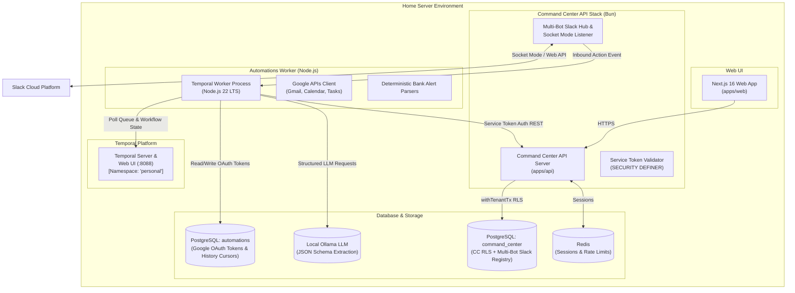
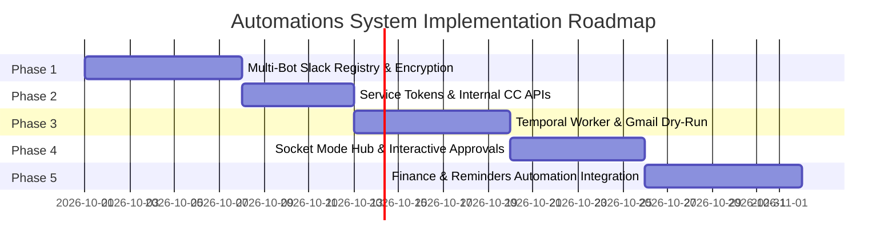

# Personal Automations + Command Center — Master Architecture Blueprint

This document defines the system topology, technical decisions, component boundaries, and overall phased implementation roadmap for extending **Command Center** with a personal automations engine.

---

## 1. System Vision & Scope

The goal of this architecture is to automate daily repetitive personal operational tasks (inbox triage, calendar/tasks synchronization, financial expense parsing from bank alerts, bill reminder creation, and daily briefs) using a resilient, extensible architecture where new automations can be introduced without structural refactoring.

### Scope & Constraints
- **Target User**: Single user (the owner). Slack workspace contains only the owner.
- **Account Scope**: Personal Google accounts (Gmail, Google Calendar, Google Tasks).
- **AI Operating Policy**: LLMs are used exclusively for **classification and extraction**. Any destructive or state-modifying action (e.g., sending an email, deleting/trashing emails, executing payments) requires explicit human approval via interactive Slack notifications.
- **Hosting Environment**: Everything runs on a single **home server** alongside the existing Command Center application stack.

---

## 2. Infrastructure & Architectural Decisions (D1–D6)

### Architectural Decisions Summary

| Decision | Area | Chosen Pattern | Rationale |
|---|---|---|---|
| **D1** | Orchestrator | **Temporal** (Dedicated `personal` namespace) | Provides durable, long-running workflow state, pause-on-failure schedules, backfill protection, and durable human-approval waits surviving service restarts. |
| **D2** | Worker Runtime | **Node.js 22 LTS** (Not Bun) | Temporal TypeScript SDK officially supports Node.js only (`worker_threads` and native V8 isolation requirements). Command Center stays on Bun. |
| **D3** | Deployment | **Separate Docker Containers on Home Server** | Command Center (Bun) and Automations Worker (Node) run in separate containers with independent DBs (`command_center` DB vs `automations` DB) and isolated life cycles. |
| **D4** | CC Integration | **Service Tokens + Zone B APIs** | Worker authenticates to Command Center using hashed org-scoped service tokens. Expenses and bill reminders flow directly into Command Center's native finance/reminders tables. |
| **D5** | Slack Platform | **Centralized Multi-Bot Registry in Command Center** | Command Center owns all Slack bot tokens (encrypted in DB), Socket Mode connections, and event dispatching. Worker never handles Slack secrets directly. |
| **D6** | AI / LLM Strategy | **Local Ollama with Strict JSON Schemas** | Deterministic Regex/code parsers first for bank emails; local Ollama with JSON schema output as fallback. Zero cloud LLM data leakage. |

---

## 3. Phased Implementation Roadmap

To maintain system stability and allow thorough review at each step, development is divided into **5 sequential phases**:

### Phase 1: Multi-Bot Slack Registry & Encrypted Management (Current Phase)
- **Goal**: Enable storing multiple Slack bot tokens in Command Center DB with envelope encryption, dynamic route mapping, `.env` fallback, and a web UI.
- **Deliverables**:
  - Migration for `slack_connections` and `slack_routes` tables with RLS.
  - Server-side envelope encryption utility (AES-256-GCM).
  - API endpoints for connections and routes CRUD + Slack token validation (`auth.test`).
  - Next.js settings UI for Slack bot & route management with masked token display.
  - Seamless fallback to legacy `SLACK_BOT_TOKEN` / `SLACK_CHANNEL_ID` environment variables.
  - 1-click button to migrate `.env` settings into the database registry.

### Phase 2: Service Tokens & Command Center Integration API
- **Goal**: Secure machine-to-machine authentication from the Automations Worker to Command Center.
- **Deliverables**:
  - `service_tokens` database table (org-scoped, SHA-256 hashed token secret, expiration, acting user).
  - High-performance `SECURITY DEFINER` token authentication function in Postgres.
  - Idempotent API endpoints for expense creation (`source + external_id`), reminder creation, and due reminder reads.
  - Service Token management UI in Command Center settings.

### Phase 3: Temporal Worker Infrastructure & Gmail Triage Dry-Run
- **Goal**: Provision the Node.js Automations Worker container and verify Gmail ingestion in dry-run mode.
- **Deliverables**:
  - Node.js 22 Automations Worker repository structure with Temporal TS SDK.
  - PostgreSQL schema for `automations` DB (Google OAuth token storage with encryption).
  - Google OAuth client configuration & local re-authentication CLI/web flow.
  - Gmail `history.list` polling workflow debounced per mailbox.
  - Morning Briefing workflow and Gmail Triage workflow running in **Dry-Run mode** (posting proposed actions to Slack route `automations.digest` without modifying Gmail state).

### Phase 4: Socket Mode Event Hub & Human Approval Engine
- **Goal**: Connect Command Center to Slack Socket Mode for interactive approval workflows.
- **Deliverables**:
  - Command Center Socket Mode connection manager supporting live reconnects and hot reload.
  - Inbound Slack event dispatcher validating approver Slack user IDs.
  - Internal webhook callback from Command Center API to Temporal Worker.
  - Interactive Slack message cards with "Approve" / "Reject" buttons.
  - Gmail trash action execution upon human approval.

### Phase 5: Finance & Reminder Automations Integration
- **Goal**: Full end-to-end processing of bank alerts, bill invoices, and calendar briefs into Command Center.
- **Deliverables**:
  - Deterministic parsers for target bank alert emails (with local unit test fixtures).
  - Automatic ingestion of parsed expenses into Command Center finance ledger via Service Token API.
  - PDF bill/invoice archiver saving to Google Drive and creating Command Center reminders.
  - Evening wrap-up summary workflow.

---

## 4. Architecture Reference Documents

The detailed technical designs for each phase reside in dedicated architecture reference files:

1. [`PHASE_1_SLACK_REGISTRY_DESIGN.md`](file:///Users/chandrashekar/Documents/Workspace/personal/memoryAllocator/docs/automations/PHASE_1_SLACK_REGISTRY_DESIGN.md) — Multi-Bot Slack Registry, Envelope Encryption, Route Mapping, and UI Specs.
2. `PHASE_2_SERVICE_TOKENS_DESIGN.md` — Service Token Authentication & Integration API Specs *(To be authored prior to Phase 2)*.
3. `PHASE_3_WORKER_TEMPORAL_DESIGN.md` — Temporal Worker Architecture & Google OAuth Integration *(To be authored prior to Phase 3)*.
