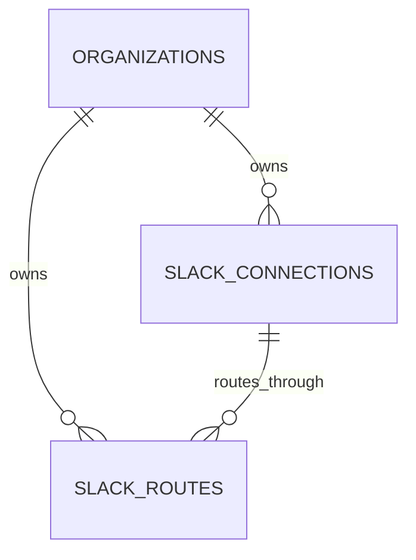
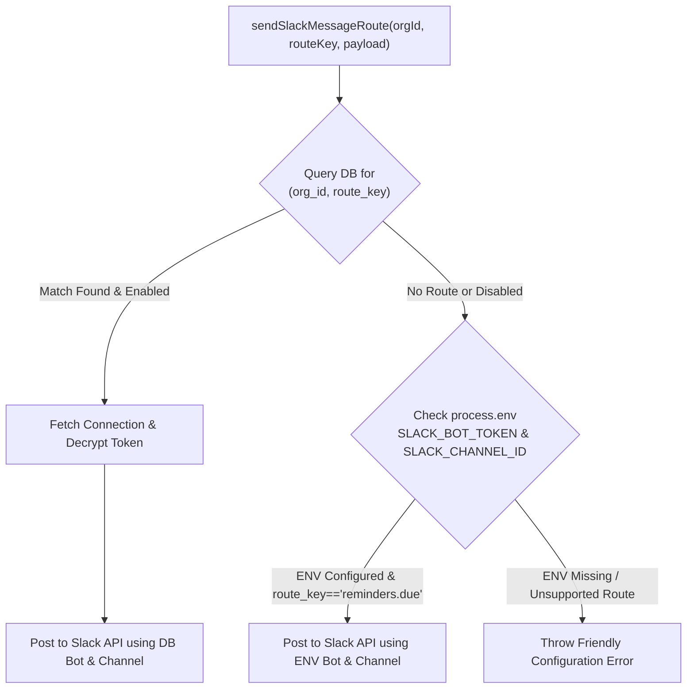

# Phase 1 Technical Design: Multi-Bot Slack Registry

This document provides the complete architecture and technical design specification for **Phase 1: Multi-Bot Slack Registry** in Command Center.

---

## 1. Executive Summary & Goals

Currently, Command Center relies on a single set of environment variables (`SLACK_BOT_TOKEN` and `SLACK_CHANNEL_ID`) for dispatching reminder alerts to Slack. To support personal automations (morning briefs, email triage approvals, financial digests, engineering alerts), Command Center requires a **Multi-Bot Slack Registry** capable of:

1. **Managing Multiple Bots**: Storing distinct Slack bots (e.g. *Personal Reminders Bot*, *Triage & Approvals Bot*, *Financial Digest Bot*) per organization.
2. **Dynamic Route Mapping**: Mapping abstract system route keys (e.g., `reminders.due`, `automations.approval`, `automations.digest`) to specific bots and channels.
3. **Encrypted Token Storage**: Securing bot tokens (`xoxb-...`) and app-level tokens (`xapp-...`) at rest using Zone B server-side envelope encryption.
4. **Interactive Security Policies**: Defining per-route button policies and restricting approval actions to specific Slack user IDs.
5. **Zero-Downtime Fallback**: Seamlessly falling back to existing `.env` credentials if no database route is configured, paired with a 1-click UI migration tool.

---

## 2. Database Schema & Data Models

A new SQL migration (`apps/api/migrations/0016_slack_registry.sql`) will introduce two tenant-isolated tables shielded by PostgreSQL Row-Level Security (RLS).



### 2.1 Table: `slack_connections`

Stores authenticated Slack bot connections and their encrypted credentials.

```sql
CREATE TABLE slack_connections (
  id                      uuid PRIMARY KEY DEFAULT gen_random_uuid(),
  org_id                  uuid NOT NULL REFERENCES organizations(id) ON DELETE CASCADE,
  name                    text NOT NULL,                     -- e.g. "Personal Operations Bot"
  workspace_id            text NOT NULL,                     -- Slack Workspace ID (e.g. "T01234567")
  bot_user_id             text NOT NULL,                     -- Slack Bot User ID (e.g. "U08976543")
  encrypted_bot_token     bytea NOT NULL,                    -- AES-256-GCM encrypted xoxb-... token
  bot_token_iv            bytea NOT NULL,                    -- Initialization vector (12 bytes)
  encrypted_app_token     bytea,                             -- Optional encrypted xapp-... token for Socket Mode
  app_token_iv            bytea,                             -- Initialization vector for app token
  encrypted_refresh_token bytea,                             -- Reserved for future OAuth token rotation
  refresh_token_iv        bytea,
  token_expires_at        timestamptz,                       -- Expiry timestamp if rotation enabled
  granted_scopes          text[] NOT NULL DEFAULT '{}',      -- Verified scopes returned by auth.test
  status                  text NOT NULL DEFAULT 'active' CHECK (status IN ('active', 'disabled', 'error', 'revoked')),
  last_verified_at        timestamptz NOT NULL DEFAULT now(),
  created_by              uuid NOT NULL REFERENCES users(id),
  created_at              timestamptz NOT NULL DEFAULT now(),
  updated_at              timestamptz NOT NULL DEFAULT now()
);

CREATE INDEX slack_connections_org_idx ON slack_connections(org_id);
```

### 2.2 Table: `slack_routes`

Maps system event keys to a connection and Slack channel ID, with interaction rules.

```sql
CREATE TABLE slack_routes (
  id                          uuid PRIMARY KEY DEFAULT gen_random_uuid(),
  org_id                      uuid NOT NULL REFERENCES organizations(id) ON DELETE CASCADE,
  route_key                   text NOT NULL,                  -- e.g. 'reminders.due', 'automations.approval'
  connection_id               uuid NOT NULL REFERENCES slack_connections(id) ON DELETE CASCADE,
  channel_id                  text NOT NULL,                  -- Slack Channel ID (e.g. "C01234567")
  channel_name                text,                           -- Optional display name (e.g. "#alerts")
  is_enabled                  boolean NOT NULL DEFAULT true,
  allow_buttons               boolean NOT NULL DEFAULT false, -- Enables interactive buttons in Slack messages
  allowed_approver_slack_ids  text[] NOT NULL DEFAULT '{}',   -- Slack User IDs authorized to click buttons
  created_at                  timestamptz NOT NULL DEFAULT now(),
  updated_at                  timestamptz NOT NULL DEFAULT now(),
  UNIQUE (org_id, route_key)                                  -- One route destination per key per organization
);

CREATE INDEX slack_routes_org_idx ON slack_routes(org_id);
```

### 2.3 Row-Level Security (RLS) Policies

```sql
ALTER TABLE slack_connections ENABLE ROW LEVEL SECURITY;
CREATE POLICY slack_connections_tenant ON slack_connections
  USING (org_id = current_setting('app.current_org_id', true)::uuid);
ALTER TABLE slack_connections FORCE ROW LEVEL SECURITY;

ALTER TABLE slack_routes ENABLE ROW LEVEL SECURITY;
CREATE POLICY slack_routes_tenant ON slack_routes
  USING (org_id = current_setting('app.current_org_id', true)::uuid);
ALTER TABLE slack_routes FORCE ROW LEVEL SECURITY;
```

---

## 3. Security & Envelope Encryption Model

Bot tokens (`xoxb-...`) and app tokens (`xapp-...`) belong to **Zone B** (Server-readable operations data). Because the server must use these tokens unattended for background HTTP posting and Socket Mode connections, they cannot be client-encrypted under a user master password (Zone A).

Instead, Zone B uses **Server-Side Envelope Encryption**:

```
                              Master Key (SLACK_ENCRYPTION_SECRET / SESSION_SECRET)
                                                     │
                                                     ▼
Raw Token ("xoxb-...") ──> AES-256-GCM Encrypt ──> Ciphertext + 12-byte IV ──> DB (bytea)
```

### 3.1 Encryption Primitive Specs (`apps/api/core/slack-crypto.ts`)
- **Algorithm**: AES-256-GCM.
- **Key Encryption Key (KEK)**: Derived from `process.env.SLACK_ENCRYPTION_SECRET` (or `SESSION_SECRET` as default fallback) using HKDF-SHA256 with info `"command-center-slack-v1"`.
- **Initialization Vector (IV)**: Cryptographically secure 12-byte random buffer generated per encryption call (`crypto.getRandomValues`).
- **Auth Tag**: AES-GCM 16-byte authentication tag appended directly to the ciphertext.

### 3.2 UI Security & Masking Guarantee
- Tokens are **write-only** over API GET endpoints.
- Endpoints return masked strings (e.g. `xoxb-1234...****5678`).
- Full unencrypted tokens exist in memory **only** during active Slack Web API / Socket Mode calls.

---

## 4. Routing Resolver & `.env` Fallback Architecture

### 4.1 Dispatch Resolver Flow

When system code (e.g. reminder sweeper or automations worker) requests a Slack dispatch for a `route_key`:



### 4.2 Resolver Implementation Specification

```typescript
export interface ResolvedSlackRoute {
  botToken: string;
  channelId: string;
  allowButtons: boolean;
  allowedApprovers: string[];
  source: "database" | "env_fallback";
}

export async function resolveSlackRoute(
  tx: SQL,
  orgId: string,
  routeKey: string
): Promise<ResolvedSlackRoute> {
  // 1. Query Database Route & Connection
  const rows = await tx`
    SELECT 
      c.encrypted_bot_token, c.bot_token_iv, c.status,
      r.channel_id, r.is_enabled, r.allow_buttons, r.allowed_approver_slack_ids
    FROM slack_routes r
    JOIN slack_connections c ON c.id = r.connection_id
    WHERE r.org_id = ${orgId} AND r.route_key = ${routeKey}
  `;

  const route = rows[0];
  if (route && route.is_enabled && route.status === "active") {
    const botToken = decryptSlackToken(route.encrypted_bot_token, route.bot_token_iv);
    return {
      botToken,
      channelId: route.channel_id,
      allowButtons: route.allow_buttons,
      allowedApprovers: route.allowed_approver_slack_ids,
      source: "database",
    };
  }

  // 2. Fallback to Legacy Environment Variables
  const envToken = process.env.SLACK_BOT_TOKEN;
  const envChannel = process.env.SLACK_CHANNEL_ID;

  if (envToken && envChannel) {
    return {
      botToken: envToken,
      channelId: envChannel,
      allowButtons: false,
      allowedApprovers: [],
      source: "env_fallback",
    };
  }

  throw new Error(`Slack notification route '${routeKey}' is not configured.`);
}
```

---

## 5. API Endpoint Specifications

All endpoints are registered under `/api/slack` in `apps/api/index.ts` and require authenticated tenant context.

| Method | Endpoint | Access | Purpose |
|---|---|---|---|
| `GET` | `/api/slack/connections` | Admin/Owner | List all registered connections with status & masked tokens. |
| `POST` | `/api/slack/connections` | Admin/Owner | Validate token with Slack `auth.test`, encrypt, and store connection. |
| `PUT` | `/api/slack/connections/:id` | Admin/Owner | Update connection name or token (re-validates if token modified). |
| `DELETE` | `/api/slack/connections/:id` | Admin/Owner | Delete connection and cascaded routes. |
| `POST` | `/api/slack/connections/:id/test` | Admin/Owner | Trigger live `auth.test` and update `last_verified_at` & `granted_scopes`. |
| `GET` | `/api/slack/routes` | Admin/Owner | List all configured route mappings. |
| `POST` | `/api/slack/routes` | Admin/Owner | Upsert a route mapping key to connection & channel. |
| `DELETE` | `/api/slack/routes/:id` | Admin/Owner | Remove a route mapping. |
| `POST` | `/api/slack/migrate-env` | Admin/Owner | 1-click import of `.env` Slack settings into DB registry. |

---

## 6. Frontend UI Screen Specifications (`apps/web`)

The Slack management UI will be added to the settings area at `apps/web/app/(app)/settings/slack/page.tsx`.

### 6.1 UI Layout Architecture

```
┌────────────────────────────────────────────────────────────────────────────────────────┐
│ Settings / Slack Integration                                                          │
├────────────────────────────────────────────────────────────────────────────────────────┤
│ ⚠️ Banner: Legacy .env configuration detected (SLACK_BOT_TOKEN).                       │
│    [ Migrate .env Bot to Database Registry ]                                           │
├────────────────────────────────────────────────────────────────────────────────────────┤
│ Slack Bot Connections                                           [ + Add New Bot ]      │
│ ┌────────────────────────────────────────────────────────────────────────────────────┐ │
│ │ 🟢 Personal Operations Bot (T01234567 / U08976543)                 [ Test ] [ Edit ]│ │
│ │ Scopes: chat:write, chat:write.public, files:write                                  │ │
│ └────────────────────────────────────────────────────────────────────────────────────┘ │
├────────────────────────────────────────────────────────────────────────────────────────┤
│ Route Mappings                                                 [ + Add Route Mapping ] │
│ ┌──────────────────────┬───────────────────────────┬──────────────┬────────┬─────────┐ │
│ │ System Route         │ Bot Connection            │ Channel      │ Status │ Actions │ │
│ ├──────────────────────┼───────────────────────────┼──────────────┼────────┼─────────┤ │
│ │ reminders.due        │ Personal Operations Bot   │ #alerts      │ Active │ [ Edit ]│ │
│ │ automations.approval │ Triage & Approvals Bot    │ #approvals   │ Active │ [ Edit ]│ │
│ │ automations.digest   │ Daily Digest Bot          │ #briefs      │ Active │ [ Edit ]│ │
│ └──────────────────────┴───────────────────────────┴──────────────┴────────┴─────────┘ │
└────────────────────────────────────────────────────────────────────────────────────────┘
```

### 6.2 Key Component Specifications
1. **Env Migration Banner**: Appears automatically if `SLACK_BOT_TOKEN` is detected in environment AND no DB connections exist yet. Clicking triggers `/api/slack/migrate-env`.
2. **Bot Connection Modal**:
   - Fields: Name, Bot Token (`xoxb-...`), App Token (`xapp-...` optional).
   - Validation: Displays real-time test badge during save by invoking Slack `auth.test`. Shows verified scopes.
3. **Route Mapping Modal**:
   - Fields: System Route Key (dropdown or custom input), Connection selector, Channel ID / Channel Name.
   - Interactive Policy Toggle: Enable buttons flag (`allow_buttons`) + Approver Slack User IDs input list.

---

## 7. Migration & Rollout Plan

1. **Database Migration**: Run `0016_slack_registry.sql` to create `slack_connections` and `slack_routes`.
2. **Backwards Compatibility**: Update `sweepDueReminders` in `apps/api/modules/reminders/routes.ts` to call `resolveSlackRoute(tx, orgId, "reminders.due")`. If no DB route exists, it seamlessly defaults to `SLACK_BOT_TOKEN` / `SLACK_CHANNEL_ID`.
3. **Audit Trail**: Every create, update, delete, and test action emits an entry to `audit_log`.

---

## 8. Verification & Review Checklist

Before proceeding to code implementation in subsequent tasks:
- [x] Schema inspected against `0005_finance.sql`, `0006_reminders.sql`, `0001_core.sql`.
- [x] Envelope encryption defined for Zone B server secrets.
- [x] Legacy `.env` fallback mechanism verified.
- [x] API endpoint table & UI component wireframe reviewed.
- [ ] **Owner Design Approval Received.**
