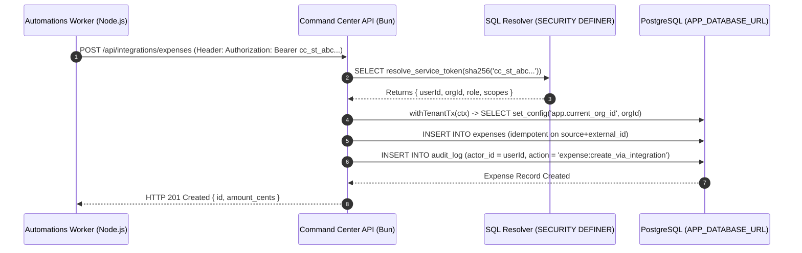

# Phase 2 Technical Design: Service Tokens & Integration APIs

This document defines the architectural and technical design for **Phase 2: Service Tokens & Internal Integration APIs** in Command Center.

---

## 1. Executive Summary & Objectives

Yes, **Phase 1 (Multi-Bot Slack Registry) is complete**. 

In **Phase 2**, we establish machine-to-machine authentication between the **Automations Worker** (running in a dedicated Node.js container) and **Command Center API** over the internal Docker network.

### Phase 2 Goals
1. **Org-Scoped Service Tokens**: Issue secret tokens (`cc_st_...`) stored as SHA-256 hashes in the database.
2. **SECURITY DEFINER Resolver**: Provide a fast, secure token resolver in PostgreSQL that bypasses RLS during initial pre-auth authentication lookup before switching to `withTenantTx`.
3. **Idempotent Integration Endpoints**:
   - `POST /api/integrations/expenses` — Idempotent expense insertion (deduplicated by `source + external_id`, e.g. `gmail:msg-123`).
   - `POST /api/integrations/reminders` — Idempotent bill reminder creation from parsed emails/invoices.
   - `GET /api/integrations/reminders/due` — Read due/overdue reminders for daily morning briefings.
4. **Audit Logging & Acting User Attribution**: Every action performed via service token is attributed to an explicit acting user (the owner) and logged in `audit_log`.
5. **UI Management**: A web interface for issuing, listing, and revoking service tokens.

> ⚠️ **NO CODE WILL BE IMPLEMENTED UNTIL THIS DESIGN IS APPROVED BY THE OWNER.**

---

## 2. Architecture & Data Flow



---

## 3. Database Schema Design

A new SQL migration (`apps/api/migrations/0017_service_tokens.sql`) will introduce the `service_tokens` table, deduplication columns, and a `SECURITY DEFINER` lookup function.

### 3.1 Table: `service_tokens`

```sql
CREATE TABLE service_tokens (
  id              uuid PRIMARY KEY DEFAULT gen_random_uuid(),
  org_id          uuid NOT NULL REFERENCES organizations(id) ON DELETE CASCADE,
  name            text NOT NULL,                            -- e.g. "Automations Worker - Home Server"
  token_hash      text NOT NULL UNIQUE,                     -- SHA-256 hex string of full secret token
  token_prefix    text NOT NULL,                            -- First 8 chars (e.g. "cc_st_a1b2c3d4")
  scopes          text[] NOT NULL DEFAULT '{}',             -- e.g. {'expenses:write', 'reminders:write', 'reminders:read'}
  acting_user_id  uuid NOT NULL REFERENCES users(id),       -- Action attribution & RLS user context
  expires_at      timestamptz,                              -- Optional expiry timestamp
  last_used_at    timestamptz,
  created_by      uuid NOT NULL REFERENCES USERS(id),
  created_at      timestamptz NOT NULL DEFAULT now(),
  updated_at      timestamptz NOT NULL DEFAULT now()
);

CREATE INDEX service_tokens_org_idx ON service_tokens(org_id);
CREATE INDEX service_tokens_hash_idx ON service_tokens(token_hash);

-- Row-Level Security
ALTER TABLE service_tokens ENABLE ROW LEVEL SECURITY;
CREATE POLICY service_tokens_tenant ON service_tokens
  USING (org_id = current_setting('app.current_org_id', true)::uuid);
ALTER TABLE service_tokens FORCE ROW LEVEL SECURITY;
```

### 3.2 Deduplication Schema Additions

To make integration writes idempotent against repeated email processing runs, `source` and `external_id` columns will be added to `expenses` and `reminders`:

```sql
ALTER TABLE expenses 
  ADD COLUMN source text,
  ADD COLUMN external_id text;

CREATE UNIQUE INDEX expenses_source_ext_idx 
  ON expenses (org_id, source, external_id) 
  WHERE source IS NOT NULL AND external_id IS NOT NULL;

ALTER TABLE reminders 
  ADD COLUMN source text,
  ADD COLUMN external_id text;

CREATE UNIQUE INDEX reminders_source_ext_idx 
  ON reminders (org_id, source, external_id) 
  WHERE source IS NOT NULL AND external_id IS NOT NULL;
```

---

## 4. SECURITY DEFINER Pre-Auth Token Resolver

Because authentication occurs *before* tenant context (`withTenantTx`) is established, querying `service_tokens` using the restricted app role (`APP_DATABASE_URL`) would fail RLS. 

A narrow `SECURITY DEFINER` function resolves the token hash cleanly without granting general cross-tenant SELECT access to the app role:

```sql
CREATE OR REPLACE FUNCTION resolve_service_token(p_token_hash text)
RETURNS TABLE (
  token_id       uuid,
  org_id         uuid,
  acting_user_id uuid,
  role           text,
  scopes         text[]
) 
LANGUAGE plpgsql
SECURITY DEFINER
SET search_path = public
AS $$
BEGIN
  RETURN QUERY
  SELECT 
    st.id AS token_id,
    st.org_id,
    st.acting_user_id,
    u.role,
    st.scopes
  FROM service_tokens st
  JOIN users u ON u.id = st.acting_user_id
  WHERE st.token_hash = p_token_hash
    AND (st.expires_at IS NULL OR st.expires_at > now());

  -- Update last used timestamp
  UPDATE service_tokens SET last_used_at = now() WHERE token_hash = p_token_hash;
END;
$$;
```

---

## 5. Integration API Endpoint Specifications

All integration endpoints are registered under `/api/integrations` and require a valid Service Token with appropriate scopes.

### 5.1 Endpoint: `POST /api/integrations/expenses`
- **Required Scope**: `expenses:write`
- **Purpose**: Creates an expense entry from a bank alert email parser.
- **Payload Schema**:
  ```json
  {
    "accountName": "HDFC Credit Card",
    "amountCents": 149900,
    "currency": "INR",
    "category": "subscription",
    "occurredOn": "2026-09-25",
    "note": "Parsed from Gmail alert (Msg: 1928ab3)",
    "source": "gmail",
    "externalId": "1928ab3c4d5e"
  }
  ```
- **Behavior**:
  - Resolves or creates matching account by name under org.
  - Inserts expense into `expenses` table using `ON CONFLICT (org_id, source, external_id) DO UPDATE` to guarantee idempotency.
  - Logs audit action `expense:create_via_integration`.

### 5.2 Endpoint: `POST /api/integrations/reminders`
- **Required Scope**: `reminders:write`
- **Purpose**: Creates a bill or invoice reminder parsed from an email attachment.
- **Payload Schema**:
  ```json
  {
    "title": "Electricity Bill - September 2026",
    "category": "bill",
    "dueOn": "2026-10-05",
    "recurrence": "monthly",
    "source": "gmail",
    "externalId": "bill-invoice-77889"
  }
  ```
- **Behavior**:
  - Inserts into `reminders` with `ON CONFLICT (org_id, source, external_id) DO UPDATE`.
  - Logs audit action `reminder:create_via_integration`.

### 5.3 Endpoint: `GET /api/integrations/reminders/due`
- **Required Scope**: `reminders:read`
- **Purpose**: Called by the Automations Worker's Morning Brief workflow to retrieve active due & overdue reminders.
- **Query Params**: `days` (default 7).
- **Response**: Array of due reminder objects.

---

## 6. Token Generation & Security Rules

1. **Token Format**: `cc_st_<32-byte random hex>` (e.g. `cc_st_7f8a9b0c...`).
2. **Storage**: Only SHA-256 hash (`token_hash`) and prefix (`token_prefix`) are stored in DB.
3. **Display**: Full raw token is displayed **once** to the user upon creation. It cannot be recovered later.
4. **Revocation**: Deleting or setting `expires_at` immediately invalidates the token.

---

## 7. Web UI Design Specifications (`apps/web`)

Location: `apps/web/app/(app)/settings/tokens/page.tsx` (or tab under Settings).

### Components:
1. **Service Token List**: Displays token name, prefix (`cc_st_a1b2...`), assigned scopes badges, acting user name, last used timestamp, and Revoke button.
2. **Issue Token Modal**:
   - Token Name input.
   - Acting User selector (defaults to current user).
   - Scopes checkboxes (`expenses:write`, `reminders:write`, `reminders:read`).
   - "Generated Token" view modal displaying raw token string with a "Copy to Clipboard" button.

---

## 8. Verification & Review Checklist

- [x] Phase 1 Multi-Bot Registry completed & tested.
- [x] Phase 2 Architecture & Security design specified.
- [ ] **Owner Design Approval Received for Phase 2.**
