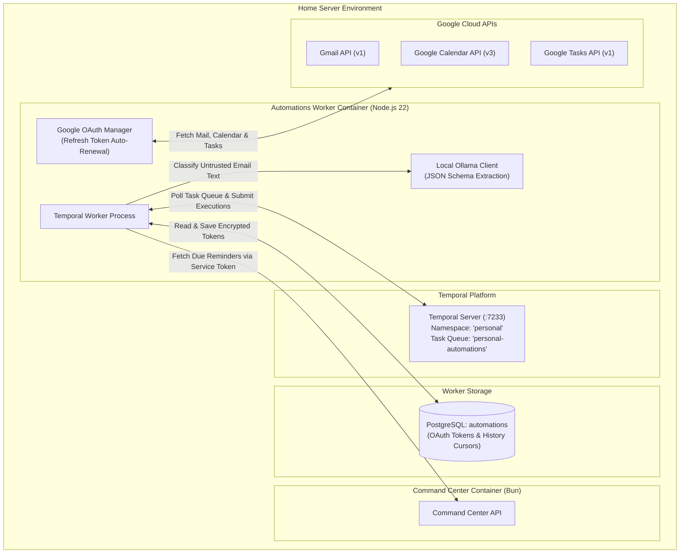
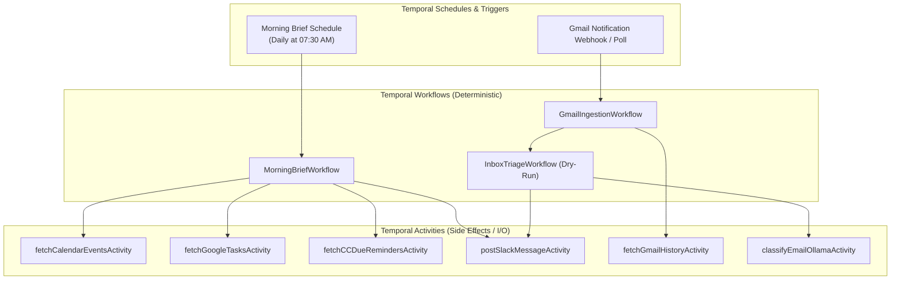

# Phase 3 Technical Design: Automations Worker & Temporal Infrastructure

This document defines the architectural and technical design for **Phase 3: Automations Worker Infrastructure, Temporal Workflows, Google OAuth Integration, and Gmail Triage Dry-Run** in Command Center.

---

## 1. Executive Summary & Objectives

In **Phase 3**, we introduce the **Automations Worker**—a dedicated Node.js service running alongside Command Center on the home server. 

### Phase 3 Goals
1. **Node.js 22 LTS Worker Stack**: Standard TypeScript repository using `@temporalio/worker` and `@temporalio/client`.
2. **Temporal Platform Integration**: Connects to the home server Temporal Server using a dedicated **`personal`** namespace and task queue.
3. **Isolated Database (`automations`)**: Dedicated PostgreSQL database for worker-private storage (encrypted Google OAuth refresh tokens and Gmail history cursors).
4. **Google OAuth 2.0 Client**: Multi-account Google OAuth integration covering Gmail (`gmail.modify`), Google Calendar (`calendar.readonly`), and Google Tasks (`tasks`).
5. **Gmail Push/Pull Ingestion Engine**: Long-lived per-mailbox ingestion workflows with 60-second debounce windows and `history.list` pagination.
6. **Morning Briefing & Inbox Triage Dry-Run Workflows**:
   - **Morning Briefing**: Daily scheduled workflow combining Calendar events, Tasks, and Command Center due reminders into a single Slack digest.
   - **Inbox Triage (Dry-Run)**: Classifies unread inbox emails using deterministic rules + local Ollama LLM, posting proposed triage actions to the `automations.digest` Slack route without mutating Gmail state.

> ⚠️ **NO CODE IS BEING IMPLEMENTED YET. THIS IS A DESIGN SPECIFICATION FOR OWNER REVIEW.**

---

## 2. System Architecture & Topology



---

## 3. Database Schema: `automations` Database

The worker uses its own PostgreSQL database (`automations`), isolated from Command Center's `command_center` database.

### 3.1 Table: `google_oauth_tokens`

```sql
CREATE TABLE google_oauth_tokens (
  id                      uuid PRIMARY KEY DEFAULT gen_random_uuid(),
  user_email              text NOT NULL UNIQUE,              -- Google account email (e.g. "owner@gmail.com")
  encrypted_access_token  bytea NOT NULL,
  access_token_iv         bytea NOT NULL,
  encrypted_refresh_token bytea NOT NULL,                   -- Offline access refresh token
  refresh_token_iv        bytea NOT NULL,
  token_expiry            timestamptz NOT NULL,
  scopes                  text[] NOT NULL DEFAULT '{}',
  created_at              timestamptz NOT NULL DEFAULT now(),
  updated_at              timestamptz NOT NULL DEFAULT now()
);
```

### 3.2 Table: `gmail_history_cursors`

```sql
CREATE TABLE gmail_history_cursors (
  user_email              text PRIMARY KEY REFERENCES google_oauth_tokens(user_email) ON DELETE CASCADE,
  last_history_id         numeric(20,0) NOT NULL,            -- Gmail historyId cursor
  last_synced_at          timestamptz NOT NULL DEFAULT now()
);
```

---

## 4. Google OAuth 2.0 Integration & Operational Constraints

1. **OAuth Consent Mode**: Must be set to **In Production** (external testing mode expires refresh tokens after 7 days). Unverified app warning is clicked once during initial authorization.
2. **Granted Scopes**:
   - `https://www.googleapis.com/auth/gmail.modify` (Allows reading, labeling, archiving, and trashing emails; permanent deletion scope `mail.google.com` is explicitly avoided).
   - `https://www.googleapis.com/auth/calendar.readonly` (Reads daily schedule across personal calendars).
   - `https://www.googleapis.com/auth/tasks` (Creates and updates task list items).
3. **Token Invalidation Handling**: If a refresh token becomes invalid (e.g., password change or revoked consent), the worker catches `invalid_grant` and dispatches an alert to the `automations.digest` Slack route containing a re-authentication link.

---

## 5. Temporal Workflows & Activities Architecture

All workflows execute inside the Node.js Automations Worker. All external network I/O (Google APIs, Command Center REST API, Ollama LLM calls) must occur inside **Temporal Activities**—never directly within workflow code.



### 5.1 Workflow 1: `GmailIngestionWorkflow`
- **Pattern**: Per-mailbox long-lived workflow.
- **Debounce Logic**: Receives push/pull notification signals, waits **60 seconds** to batch multiple rapid incoming emails, then executes `fetchGmailHistoryActivity`.
- **Cursor Tracking**: Updates `gmail_history_cursors` table atomically in database.
- **Short Catch-up Window**: Schedules use a **1-hour catch-up window** so that after server downtime, missed runs do not stack or replay late.

### 5.2 Workflow 2: `MorningBriefWorkflow`
- **Schedule**: Temporal Cron Schedule running daily at **07:30 AM**.
- **Execution Flow**:
  1. `fetchCalendarEventsActivity`: Queries today's events across personal Google Calendars.
  2. `fetchGoogleTasksActivity`: Queries pending Google Tasks due today or overdue.
  3. `fetchCCDueRemindersActivity`: Calls Command Center API `/api/integrations/reminders/due` via Service Token.
  4. Formats Markdown morning brief.
  5. `postSlackMessageActivity`: Posts brief to Command Center Slack route `automations.digest`.

### 5.3 Workflow 3: `InboxTriageWorkflow` (Dry-Run Mode)
- **Execution Flow**:
  1. `fetchUnreadInboxMessagesActivity`: Retrieves new unread INBOX messages.
  2. `classifyEmailOllamaActivity`: Calls local Ollama LLM with strict JSON schema to classify email into categories (`promotional`, `transactional_bank`, `actionable_bill`, `personal_important`, `spam`).
  3. **Dry-Run Posting**: Formats a proposed triage summary (e.g. `[Dry-Run] Would trash 4 promo emails, archive 2 receipts`).
  4. Posts summary to Slack route `automations.digest`. **Zero modifications are applied to Gmail in Phase 3.**

---

## 6. Verification & Review Checklist

- [x] Node.js 22 Automations Worker architecture defined.
- [x] Temporal `personal` namespace & activity isolation specified.
- [x] Worker database (`automations`) schema created.
- [x] Google OAuth constraints & refresh token handling documented.
- [x] Dry-run execution model for Gmail triage verified.
- [ ] **Owner Design Approval Received for Phase 3.**
