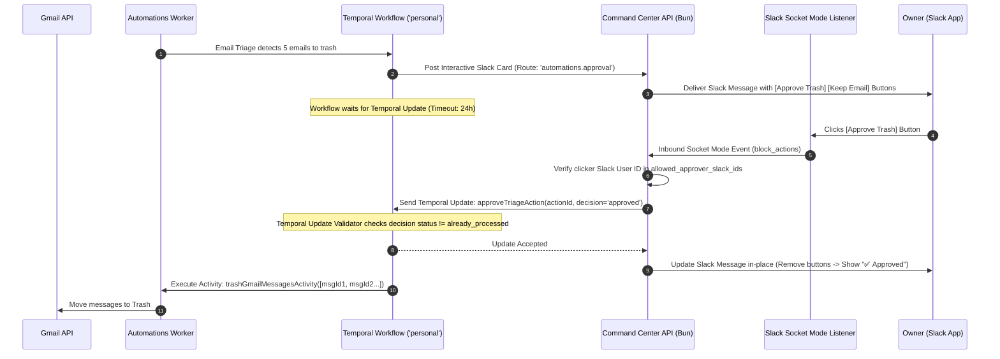

# Phase 4 Technical Design: Slack Socket Mode Hub & Human Approval Engine

This document defines the architectural and technical design for **Phase 4: Slack Socket Mode Connection Manager, Event Dispatcher, and Temporal Interactive Approvals** in Command Center.

---

## 1. Executive Summary & Objectives

In **Phase 4**, we enable **interactive human approval workflows** in Slack. While AI handles email classification and parsing, destructive actions (e.g., trashing emails or executing large operations) require explicit human approval via interactive Slack buttons.

### Phase 4 Goals
1. **Socket Mode Manager in Command Center**: Command Center (`apps/api`) maintains long-lived WebSocket Socket Mode connections to Slack for interactive bots.
2. **Approver Authorization Verification**: Validates that incoming button clicks originate from authorized Slack user IDs (`allowed_approver_slack_ids`).
3. **Temporal Update Signals with Validation**: Uses Temporal **Updates** (with validator functions) to process approval decisions, preventing double-clicks and race conditions.
4. **24-Hour Approval Timeout**: Approvals wait for a maximum of 24 hours. If unacted upon, the workflow safely times out and leaves Gmail state untouched.
5. **In-Place Slack Message Updating**: Replaces interactive buttons with status badges (`✅ Approved by @owner` / `❌ Rejected by @owner`) upon decision.

> ⚠️ **NO CODE IS BEING IMPLEMENTED YET. THIS IS A DESIGN SPECIFICATION FOR OWNER REVIEW.**

---

## 2. Interactive Approval Sequence & Data Flow



---

## 3. Command Center Socket Mode Connection Hub

Command Center owns all Slack connections and WebSocket connections. The Automations Worker never opens a direct connection to Slack.

```typescript
// Conceptual Manager structure in apps/api/core/slack-socket.ts
export class SlackSocketManager {
  private connections = new Map<string, SocketModeClient>();

  async syncConnections(tx: SQL, orgId: string) {
    // Queries slack_connections where encrypted_app_token IS NOT NULL and status = 'active'
    // Opens or updates long-lived WebSocket connections
  }

  private handleBlockAction(payload: SlackBlockActionPayload) {
    // 1. Extract action_id, user_id, channel_id, message_ts
    // 2. Validate user_id against allowed_approver_slack_ids for the route
    // 3. Dispatch to Temporal Worker or Internal Callback API
  }
}
```

### Key Security & Operational Controls
- **Outbound-Only WebSockets**: Socket Mode connects outward over TLS WebSockets (`wss://`). No inbound public ports or webhooks required on the home server.
- **Hot Reloading via Redis**: When a bot connection or app token is updated in the UI, a Redis Pub/Sub signal notifies the API process to refresh WebSocket clients instantly.

---

## 4. Slack Block Kit Interactive Message Format

Interactive approval messages sent to the `automations.approval` route use Slack Block Kit cards:

```json
{
  "blocks": [
    {
      "type": "header",
      "text": { "type": "plain_text", "text": "📥 Inbox Triage Approval Required" }
    },
    {
      "type": "section",
      "text": {
        "type": "mrkdwn",
        "text": "*4 Promotional Emails Classified for Trash:*\n• Newsletter A (newsletter@promo.com)\n• Product Deal B (deals@shop.com)\n• Weekly Digest C (digest@news.com)\n• Marketing Offer D (marketing@service.com)"
      }
    },
    {
      "type": "actions",
      "block_id": "approval_actions",
      "elements": [
        {
          "type": "button",
          "action_id": "approve_triage",
          "text": { "type": "plain_text", "text": "Approve Trash" },
          "style": "danger",
          "value": "{\"workflowId\":\"triage-wf-101\",\"actionId\":\"act-992\",\"decision\":\"approve\"}"
        },
        {
          "type": "button",
          "action_id": "reject_triage",
          "text": { "type": "plain_text", "text": "Keep All Emails" },
          "style": "primary",
          "value": "{\"workflowId\":\"triage-wf-101\",\"actionId\":\"act-992\",\"decision\":\"reject\"}"
        }
      ]
    }
  ]
}
```

---

## 5. Temporal Update & Validator Design

Temporal Signals can suffer from race conditions or unvalidated double-clicks. Phase 4 uses **Temporal Updates** with validator functions:

```typescript
// Inside InboxTriageWorkflow
export const submitApprovalUpdate = Workflow.defineUpdate<
  { success: boolean; reason?: string },
  [{ actionId: string; decision: 'approved' | 'rejected'; approverSlackId: string }]
>('submitApproval');

let approvalState: 'pending' | 'approved' | 'rejected' = 'pending';

// Validator prevents double decisions
Workflow.setHandler(
  submitApprovalUpdate,
  (params) => {
    approvalState = params.decision;
    return { success: true };
  },
  {
    validator: (params) => {
      if (approvalState !== 'pending') {
        throw new Error(`Approval already processed with status: ${approvalState}`);
      }
    },
  }
);

// Workflow execution wait
const approved = await Workflow.condition(() => approvalState !== 'pending', '24 hours');
if (!approved || approvalState === 'rejected') {
  // Safe fallback: do not trash emails
  await postSlackUpdateActivity({ status: 'rejected_or_expired' });
  return;
}

// Proceed to trash
await trashGmailMessagesActivity(messagesToTrash);
```

---

## 6. Verification & Review Checklist

- [x] Socket Mode WebSocket connection manager in Command Center specified.
- [x] Approver Slack User ID authorization policy designed.
- [x] Slack Block Kit approval card structure defined.
- [x] Temporal Update handler and validator race-condition prevention specified.
- [x] 24-hour safe timeout policy established.
- [ ] **Owner Design Approval Received for Phase 4.**
