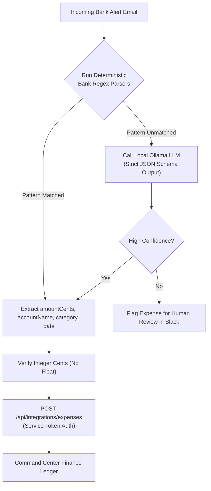

# Phase 5 Technical Design: Finance & Reminders Automations Integration

This document defines the architectural and technical design for **Phase 5: Bank Alert Expense Parsing, Bill/Invoice Archiver, Google Tasks Sync, and Evening Wrap-up Workflow** in Command Center.

---

## 1. Executive Summary & Objectives

In **Phase 5**, we connect automated email intelligence directly into Command Center's native **Finance** and **Reminders** modules (Zone B), eliminating manual entry for bank expenses, recurring bills, and task rollovers.

### Phase 5 Goals
1. **Deterministic Bank Alert Parsers**: Parse transactional bank alert emails (HDFC, ICICI, SBI, Axis) using regex/code parsers backed by local unit test fixtures.
2. **Ollama LLM Fallback**: Use local Ollama (JSON schema output) as a fallback parser when regex patterns do not match.
3. **Integer Cents Financial Calculations**: Parse and send money exclusively as integer cents/paise (`amountCents bigint`) to `/api/integrations/expenses`.
4. **Bill Invoice Archiver**: Extract PDF bill statements, upload them to Google Drive, and create bill reminders via `/api/integrations/reminders`.
5. **Email $\rightarrow$ Google Tasks Capture**: Convert action items in personal emails into Google Tasks items.
6. **Evening Wrap-up & Task Rollover Workflow**: Daily 08:00 PM scheduled workflow summarizing accomplishments and rolling overdue tasks forward.

> ⚠️ **NO CODE IS BEING IMPLEMENTED YET. THIS IS A DESIGN SPECIFICATION FOR OWNER REVIEW.**

---

## 2. Bank Alert Expense Parsing Architecture



### 2.1 Deterministic Bank Parsers & Fixtures
Each target bank has a dedicated TypeScript module in the Automations Worker (`src/parsers/banks/hdfc.ts`, `icici.ts`, `sbi.ts`) paired with local text fixtures in `test/fixtures/bank-emails/`:

- **HDFC Credit Card Alert**:
  - Sample snippet: `Rs. 1,499.00 spent on HDFC Bank Card XX1234 at NETFLIX on 2026-09-25`.
  - Extracted fields: `amountCents: 149900`, `accountName: "HDFC Credit Card XX1234"`, `currency: "INR"`, `category: "subscription"`, `occurredOn: "2026-09-25"`.
- **ICICI Bank Account Debit**:
  - Extracted fields: `amountCents: 450000`, `accountName: "ICICI Savings"`, `currency: "INR"`, `category: "utility"`.

### 2.2 Financial Integrity Guarantees
- **Zero Floating-Point Math**: All monetary amounts are converted to integer cents/paise immediately upon parsing (`Math.round(val * 100)`).
- **Database Idempotency**: Written to Command Center API with `source = 'gmail'` and `externalId = messageId`. Duplicate emails will not produce duplicate expenses.

---

## 3. Bill & Invoice Archiver Workflow

When an email arrives containing a monthly utility bill or invoice (e.g. Electricity, Mobile Postpaid, Broadband):

1. **Attachment Extraction**: Temporal Activity extracts PDF attachment from Gmail message.
2. **Google Drive Storage**: Activity uploads PDF statement to Google Drive folder (`/CommandCenter/Invoices/2026/`).
3. **DueDate Extraction**: Regex or Ollama parses statement due date and total amount due.
4. **Command Center Reminder Creation**: Activity calls `/api/integrations/reminders`:
   ```json
   {
     "title": "Airtel Broadband Bill - ₹1,179",
     "category": "bill",
     "dueOn": "2026-10-05",
     "recurrence": "monthly",
     "source": "gmail",
     "externalId": "bill-airtel-2026-09"
   }
   ```

---

## 4. Evening Wrap-up & Task Rollover Workflow

- **Schedule**: Temporal Cron Schedule running daily at **20:00 PM** (8:00 PM).
- **Workflow Execution**:
  1. `fetchCompletedTasksActivity`: Queries Google Tasks completed today.
  2. `fetchAcknowledgedRemindersActivity`: Queries Command Center reminders acknowledged today.
  3. `rolloverOverdueTasksActivity`: Finds Google Tasks due today or earlier that remain uncompleted, updating their `due` date to tomorrow.
  4. `postSlackMessageActivity`: Posts evening wrap-up digest to Slack route `automations.digest`:

```markdown
🌆 *Evening Wrap-up & Daily Summary*

*Completed Today:*
• ✅ Paid Airtel Broadband Bill (₹1,179)
• ✅ Reviewed Q3 Tax Deductions
• ✅ Archived 6 promotional emails

*Task Rollover:*
• ⏩ Moved 2 uncompleted tasks to tomorrow (Update server back-up script, Renew domain)

Great work today! Have a good evening.
```

---

## 5. Master Phased Documentation Summary

With this document, all 5 phases of the Personal Automations + Command Center architecture have comprehensive, non-code technical design specifications:

| Phase | Design Document | Primary Scope | Status |
|---|---|---|---|
| **Phase 1** | [`PHASE_1_SLACK_REGISTRY_DESIGN.md`](file:///Users/chandrashekar/Documents/Workspace/personal/memoryAllocator/docs/automations/PHASE_1_SLACK_REGISTRY_DESIGN.md) | Multi-bot Slack registry, envelope encryption, route mapping, UI screens | **Design & Implementation Complete** |
| **Phase 2** | [`PHASE_2_SERVICE_TOKENS_DESIGN.md`](file:///Users/chandrashekar/Documents/Workspace/personal/memoryAllocator/docs/automations/PHASE_2_SERVICE_TOKENS_DESIGN.md) | Service tokens, `SECURITY DEFINER` pre-auth resolver, internal integration APIs | **Design Complete (Pending Owner Review)** |
| **Phase 3** | [`PHASE_3_WORKER_TEMPORAL_DESIGN.md`](file:///Users/chandrashekar/Documents/Workspace/personal/memoryAllocator/docs/automations/PHASE_3_WORKER_TEMPORAL_DESIGN.md) | Automations worker, Temporal TS SDK, Google OAuth, Gmail triage dry-run | **Design Complete (Pending Owner Review)** |
| **Phase 4** | [`PHASE_4_SOCKET_MODE_APPROVALS_DESIGN.md`](file:///Users/chandrashekar/Documents/Workspace/personal/memoryAllocator/docs/automations/PHASE_4_SOCKET_MODE_APPROVALS_DESIGN.md) | Socket Mode connection hub, interactive Slack buttons, Temporal update signals | **Design Complete (Pending Owner Review)** |
| **Phase 5** | [`PHASE_5_FINANCE_REMINDERS_AUTOMATION_DESIGN.md`](file:///Users/chandrashekar/Documents/Workspace/personal/memoryAllocator/docs/automations/PHASE_5_FINANCE_REMINDERS_AUTOMATION_DESIGN.md) | Bank alert parsers, bill archiver, Google Tasks sync, Evening wrap-up | **Design Complete (Pending Owner Review)** |

---

## 6. Verification & Review Checklist

- [x] Bank alert parser hierarchy (regex + Ollama fallback) designed.
- [x] Integer cents financial calculation rules enforced.
- [x] Google Drive bill archiver & reminder creation pipeline specified.
- [x] Evening wrap-up & task rollover workflow designed.
- [ ] **Owner Design Approval Received for Phase 5.**
